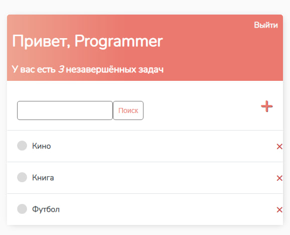

# ToDo приложение на Django

#### Это приложение представляет собой To-Do список, который позволяет пользователям создавать задачи, отмечать их как выполненные и искать задачи по заголовку. В приложении реализована регистрация пользователей, так что каждый пользователь может создать свой собственный список задач.

## Функциональность

* Регистрация и аутентификация пользователей
* Создание, чтение, обновление и удаление задач
* Поиск задач по заголовку

## Технологии

#### Это приложение написано на языке Python, используя Django Framework. Django - это бесплатный и открытый фреймворк, который помогает разработчикам создавать быстрые и масштабируемые веб-приложения. Для хранения данных используется SQLite, но можно использовать любую другую СУБД, поддерживаемую Django.
## Установка
1. Клонируйте репозиторий на свой компьютер.
2. Создайте виртуальное окружение и активируйте его.
3. Установите зависимости командой pip install -r requirements.txt.
4. Создайте базу данных PostgreSQL и настройте ее в файле settings.py.
5. Примените миграции командой python manage.py migrate.
6. Запустите приложение командой python manage.py runserver.
7. Перейдите на страницу http://127.0.0.1:8000/ в вашем браузере.

## Дополнительная информация
#### Это приложение было написано с использованием Django 4.1 и Python 3.1.11. Вы можете узнать больше о Django в официальной документации.
### Фото



Автор
```Хусрав```